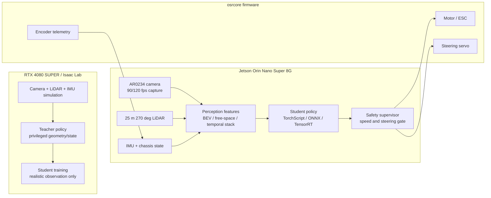

# Feasibility and Sensor-First Plan

`osracer_lab` already has training, export, parameter checks, and a documentation site. The current risk is that it does not yet make the real car's strongest sensors central to the closed loop: the 25 m 270-degree LiDAR, AR0234 global-shutter 120 fps camera, IMU, encoder, and chassis telemetry.

The recommended direction is to shift from "train a simulated behavior" to "define a deployable real-sensor closed loop".

## Main Risks

| Risk | Impact | Response |
|---|---|---|
| Policy depends on simulator truth | The real car does not have `root_pos_w`, ideal velocity, or ideal pose | Deployment policy must only consume observations available from real ROS topics |
| Camera is documented but not in a perception loop | The low-latency value of the 120 fps global shutter camera is unused | Define camera input, calibration, downsampling, timing, and feature contracts |
| LiDAR is not part of the core loop | The 25 m geometry sensor is unused for safety and obstacle handling | Use LiDAR for local free-space, occupancy, and safety features |
| Sensor timing is unclear | Fusion and replay results are not trustworthy | Record timestamp source, frequency, latency, and frame ID for every topic |
| Jetson limits are not designed around | The trained system may not run on Orin Nano 8G in real time | Separate 4080S training from Jetson inference |

## Recommended Architecture

## Sensor Strategy

### Camera

The AR0234 120 fps global-shutter camera is valuable because it reduces motion blur and latency. It should not be used by feeding full 1920x1200 frames directly into the policy.

Recommended setup:

- Capture at `90/120 fps` on the real car.
- Run the policy at `30-50 Hz` first.
- Train with downsampled images, grayscale images, temporal stacks, or compact visual features.
- Keep the latest `2-4` frames for temporal context.
- Use real `CameraInfo`; do not use the nominal `130 deg` field of view as calibration.

Practical first input:

| Input | Recommendation |
|---|---|
| Resolution | Start with `320x192`, `384x216`, or `640x360` |
| Rate | Capture at `90/120 fps`, consume at `30/50 Hz` |
| Color | Prefer grayscale or lightweight RGB |
| History | Latest `2-4` frames |
| Calibration | `fx/fy/cx/cy/distortion` required |

### LiDAR

The 25 m, 270-degree LiDAR should be part of the real-car loop and safety layer, not just a documented parameter.

Implement these features first:

| Feature | Use |
|---|---|
| Polar range bins | Policy input with nearest ranges around front and sides |
| Local occupancy grid | Geometry input for sim2real and teacher/student training |
| Safety distances | Speed limit, steering limit, and emergency stop gate |

Initial setup:

- Start with `270 deg / 0.25 deg / 10 Hz / 25 m`, matching the current simulation config.
- Confirm real topic, `frame_id`, timestamp source, and scan direction.
- Move to `0.1 deg` or higher spin rates only after replay is stable.

### IMU and Chassis State

IMU, encoder, motor target/feedback, and steering target/feedback are more important than simulator-only truth for deployment stability.

Deployment policy may use:

- Latest speed estimate.
- Latest angular velocity.
- Latest acceleration.
- Last `N` actions.
- Steering target and steering feedback if available.
- Motor target and encoder speed.

Deployment policy should not use:

- Simulator world position.
- Simulator Euler-angle truth unless the real car has an equivalent filtered topic.
- Ideal contact state.
- Ideal tire slip state.

## Teacher / Student Route

Use a LiDAR / geometry teacher and a camera-capable student:

1. The teacher can use privileged geometry, LiDAR, local map, and full simulator state.
2. The student only uses real-car camera, LiDAR, IMU, and chassis history.
3. Real-car deployment keeps a LiDAR safety supervisor active.
4. The vision student must pass rosbag replay before any low-speed closed loop.

This is more realistic than deploying an end-to-end camera policy directly, especially on Jetson Orin Nano 8G.

## Minimum Milestones

### M1: Sensor Contract

Success criteria:

- Camera, LiDAR, IMU, chassis, and command topics have frequency, frame ID, and timestamp source.
- Sim observations match real ROS observations.
- Deployment observations contain no simulator-only truth.

Suggested additions:

- `docs/sensor_contract.md`
- `scripts/check_policy_observation_contract.py`

### M2: Real Log Capture and Replay

Success criteria:

- A rosbag contains camera, LiDAR, IMU, chassis, and command streams.
- Offline replay can generate policy inputs.
- Perception and policy forward pass can run without connecting actuators.

ROS-side recorder and replay should live in `osracer feat-demo`; `osracer_lab` should keep the contracts, checks, and training-side adaptation.

### M3: LiDAR Safety Layer

Success criteria:

- Limit speed or stop when frontal obstacles are too close.
- Limit steering or speed when side clearance is too small.
- Safety does not depend on the policy being correct.

### M4: Jetson Low-Speed Loop

Success criteria:

- Jetson logs inference latency, CPU/GPU load, and memory use.
- Policy rate is stable.
- First floor tests stay at or below `0.3 m/s`.
- Both wheels-off-ground and low-speed floor tests produce evidence packs.

### M5: Vision Policy Expansion

Success criteria:

- Camera calibration is imported.
- Image preprocessing matches simulation randomization.
- Visual features are stable in real replay.
- Speed and scene complexity increase only after replay and low-speed tests pass.

## Parameters Still Needed

| Area | Required values |
|---|---|
| Camera intrinsics | `fx`, `fy`, `cx`, `cy`, distortion model, distortion coefficients |
| Camera runtime | Real topic, resolution, fps, format, exposure mode, hardware timestamp availability |
| Camera extrinsics | `base_link -> camera_link` as `x/y/z/roll/pitch/yaw` |
| LiDAR runtime | Model, topic, `frame_id`, rate, angular resolution, scan direction, timestamp source |
| LiDAR extrinsics | `base_link -> laser` as `x/y/z/roll/pitch/yaw` |
| IMU | Topic, rate, range, mounting direction, filtered orientation availability |
| Chassis state | Real speed, steering feedback, motor RPM, encoder ticks, chassis-state topic |
| Control latency | Command-to-steering response, command-to-motor response, serial round-trip latency |
| Jetson | JetPack, ROS, CUDA/TensorRT versions, power mode |

## Recommended Near-Term Changes

Execute in this order:

1. Pause expansion of complex visual RL tasks.
2. Define `sensor_contract` and `policy_observation_contract`.
3. Put LiDAR features and the safety layer into the first closed-loop target.
4. Make real rosbag replay a hard gate before closed-loop driving.
5. Run only lightweight perception, policy, and safety on Jetson; keep training on the server.

After this, `osracer_lab` will look like a feasible sim2real project instead of only a simulation-training demo.
