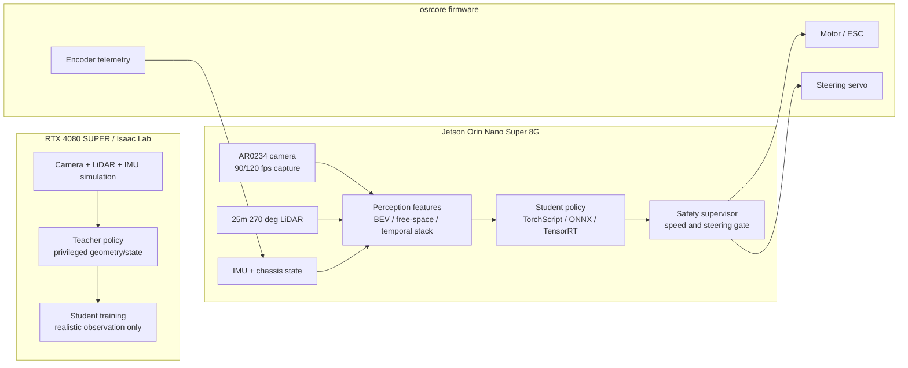

# 可行性与传感器闭环方案

当前 `osracer_lab` 已经有训练、导出、参数检查和文档框架，但还没有充分利用真实车上的核心传感器：25m 270 度激光雷达、AR0234 全局快门 120fps 相机、IMU、编码器和底盘反馈。继续只围绕仿真真值训练，会降低 sim2real 的可落地性。

推荐方向是把项目重心从“仿真里训练动作”调整为“围绕真实传感器闭环定义可部署系统”。

## 当前主要风险

| 风险 | 影响 | 处理方式 |
|---|---|---|
| policy 依赖仿真真值 | 实车没有 `root_pos_w`、理想速度、理想姿态等数据 | 部署策略只能使用真实 ROS topic 可提供的 observation |
| 相机只写了参数，没有形成感知链路 | 120fps 全局快门的低延迟优势没有发挥 | 建立相机输入、标定、降采样、时序和特征输出合同 |
| 雷达没有进入核心闭环 | 25m 几何感知能力没有用于避障和安全 | 用雷达生成局部 free-space / occupancy / safety feature |
| 传感器时间关系不清楚 | 多传感器融合和 replay 结果不可信 | 记录每个 topic 的时间戳来源、频率、延迟和 frame_id |
| Jetson 资源约束没有前置 | 训练方案可能无法在 Orin Nano 8G 上实时运行 | 训练服务器和 Jetson 推理解耦，Jetson 只跑轻量推理和安全层 |

## 推荐总体架构

## 传感器使用策略

### 相机

AR0234 全局快门 120fps 的价值主要是低延迟和高速运动下更少拖影，不是把 1920x1200 原图直接输入策略。

建议：

- 实车采集保持 `90/120 fps`，用于降低感知延迟。
- policy 频率先按 `30-50 Hz` 设计。
- 训练输入使用降采样图像、灰度图、时序堆叠或视觉特征。
- 保留最近 `2-4` 帧，用于判断运动趋势或光流。
- 必须使用真实 `CameraInfo`，不能用标称 `130 deg` 直接替代标定。

短期可落地输入：

| 输入 | 建议 |
|---|---|
| 分辨率 | `320x192`、`384x216` 或 `640x360` 起步 |
| 帧率 | 采集 `90/120 fps`，policy 消费 `30/50 Hz` |
| 色彩 | 优先灰度或轻量 RGB |
| 历史 | 最近 `2-4` 帧 |
| 标定 | `fx/fy/cx/cy/distortion` 必填 |

### 激光雷达

25m、270 度、最高 0.1 度分辨率的雷达应该成为实车闭环和 safety 的核心，而不是只作为参数记录。

建议先实现三类特征：

| 特征 | 用途 |
|---|---|
| polar range bins | 策略输入，保留前方和侧方最近距离 |
| local occupancy grid | sim2real 一致的几何输入，可做 teacher / student 蒸馏 |
| safety distances | 策略输出后的限速、避障、急停 gate |

短期配置建议：

- 先用 `270 deg / 0.25 deg / 10 Hz / 25 m`，和当前仿真配置一致。
- 确认真实雷达 topic、`frame_id`、时间戳和 scan direction。
- 真实 replay 稳定后，再考虑 `0.1 deg` 或更高转速。

### IMU 和底盘状态

IMU、编码器、电机目标/反馈、舵角目标/反馈是策略稳定性的底座。它们比仿真真值更重要。

部署策略允许使用：

- 最近一次速度估计。
- 最近一次角速度。
- 最近一次加速度。
- 最近 `N` 步 action history。
- 舵角目标和可用时的舵角反馈。
- 电机目标和编码器速度。

部署策略不应使用：

- 仿真世界坐标位置。
- 仿真欧拉角真值，除非实车有等价滤波输出。
- 理想接触状态。
- 理想轮胎侧偏量。

## Teacher / Student 路线

推荐采用 LiDAR / geometry teacher 与 camera student 的分层路线：

1. Teacher 在仿真中可使用几何真值、雷达、局部地图和完整状态。
2. Student 只使用真实车可获得的相机、雷达、IMU、底盘历史。
3. 实车部署时优先启用 LiDAR safety supervisor。
4. 视觉 student 先通过真实 rosbag replay 验证，再进入低速闭环。

这个路线比“相机端到端直接上车”更稳，也更符合 Jetson Orin Nano 8G 的算力边界。

## 最小可落地里程碑

### M1：传感器合同

成功标准：

- 列出 camera、LiDAR、IMU、chassis、cmd 的 topic、频率、frame_id、时间戳来源。
- 仿真 observation 和真实 ROS observation 一一对应。
- 部署 observation 中不再出现仿真独有真值。

建议新增或完善：

- `docs/sensor_contract.md`
- `scripts/check_policy_observation_contract.py`

### M2：真实日志采集与 replay

成功标准：

- 能采集一段包含 camera、LiDAR、IMU、chassis、cmd 的 rosbag。
- 能离线回放并生成 policy 输入。
- 不连接实车执行器，也能跑完整感知和 policy 前向。

建议依赖 `osracer feat-demo` 的 recorder 和 replay 工具维护 ROS 侧功能，`osracer_lab` 只维护合同、检查和训练侧适配。

### M3：LiDAR safety layer

成功标准：

- 前方障碍过近时强制限速或停车。
- 左右侧空间不足时限制转向或速度。
- safety 逻辑不依赖 policy 是否正确。

### M4：Jetson 低速闭环

成功标准：

- Jetson 上记录推理延迟、CPU/GPU/内存占用。
- policy 频率稳定。
- 首次落地速度不超过 `0.3 m/s`。
- 架空测试和低速地面测试都有 evidence pack。

### M5：视觉策略增强

成功标准：

- 相机标定已导入。
- 图像预处理和仿真随机化一致。
- 真实 replay 中视觉特征稳定。
- 再逐步提高速度和复杂场景。

## 当前应补充的参数

| 类别 | 必填项 |
|---|---|
| 相机内参 | `fx`、`fy`、`cx`、`cy`、畸变模型、畸变系数 |
| 相机运行 | 真实 topic、分辨率、fps、格式、曝光模式、是否硬件时间戳 |
| 相机外参 | `base_link -> camera_link` 的 `x/y/z/roll/pitch/yaw` |
| 雷达运行 | 型号、topic、`frame_id`、频率、角分辨率、scan direction、时间戳来源 |
| 雷达外参 | `base_link -> laser` 的 `x/y/z/roll/pitch/yaw` |
| IMU | topic、频率、量程、安装方向、是否滤波姿态 |
| 底盘状态 | 是否有真实速度、舵角反馈、电机转速、编码器 tick、底盘状态 topic |
| 控制延迟 | command 到舵机响应、command 到电机响应、串口往返延迟 |
| Jetson | JetPack 版本、ROS 版本、CUDA/TensorRT 版本、运行功耗模式 |

## 建议的近期改动

按优先级执行：

1. 暂停继续扩大视觉 RL 任务复杂度。
2. 建立 `sensor_contract` 和 `policy_observation_contract`。
3. 把 LiDAR feature 和 safety layer 放进第一阶段闭环。
4. 用真实 rosbag replay 作为进入实车闭环前的硬门槛。
5. Jetson 上只部署轻量 perception、policy 和 safety，不在车上训练。

完成这些后，`osracer_lab` 才更像一个可实施的 sim2real 项目，而不是只停留在仿真训练 demo。
